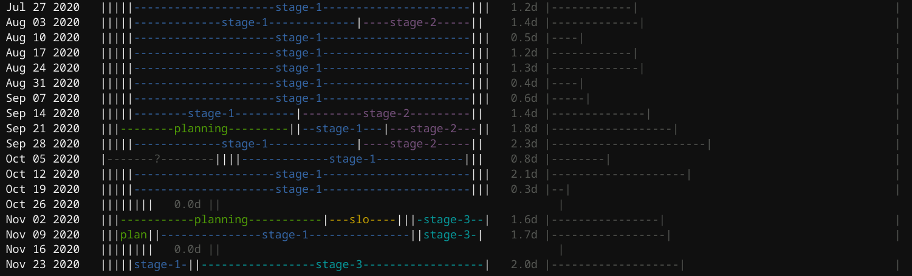

```
Time Flies (tf) is a tool for budgeting focus time.

Usage:
  tf [command]

Available Commands:
  edit        Edit the log file.
  help        Help about any command
  tidy        Reformats log to spark joy.
  todo        List TODO entries.
  tots        Output weekly focus totals.

Flags:
  -c, --config string   Config file. JSON serialization of pkg/cmd/Config.
  -f, --focus string    Focus on a particular label group.
  -g, --group strings   Group entries by labels.
  -h, --help            help for tf
  -l, --log string      Log file.
  -p, --period string   Aggregation period.

Use "tf [command] --help" for more information about a command.
```
# Overview

Time Flies (`tf`) is a text-oriented tool for keeping track of focus time. The center of `tf` is the log, a plaintext file into which daily activities are written, one per line. The log is as a record with metadata (time spent, focus category, etc...) and a TODO list.

## Example Log


Output of `tf tots`:


## Philosophy

Time Flies shows focus over time. All the hours of the workday are accounted for by tracking the ratio of focus on various categories of activity (e.g. `cat=ops`). Activies are weighted by time which is a proxy for focus. Some activities involve a period of focused time as well as some "fuzzy" time surrounding them. These activites are recorded as "fuzzy time" (e.g. `f=1h`) from which all hours of the work week are extrapolated. But some activites simply require a precise amount of time in which case they are taken literally, without extrapolation (e.g. `t=45m`). The `tf tots` command prints the ratio of focus on each category as well as the absolute time accounted for (e.g. `5d`) and the amount of extrapolation done to account for that time (e.g. `fx=2.6`). See [#algorithm](algorithm) below for more details.

The insights given by `tf` are only as good as the categories chosen and the quality of the log file entries. The format of the log file is chosen to be as simple and easy to maintain as possible. It's essentially the log I was keeping anyway (a.k.a. snippets) with some tags at the end (e.g. `.. ## cat=customer`). However the specific category and sub-category values require some effort and reflection to produce.

### My Categories

Here are the categories I use consistently (e.g. `cat=primary`):
1. **primary** -- the project for which I am directly responsible.
2. **secondary** -- the project(s) for which my co-workers are responsible.
3. **non** -- side projects started which might grow into primary or secondary.
4. **customer** -- supporting end-users of our products.
5. **community** -- supporting community inside and outside the company.
6. **business-stuff** -- overhead things like perf and trainings.
7. **time-away** -- vacation, ping-pong, etc..

I've budgeted my categories ahead of time.  E.g. I know I want to spend at least 30% of my time on my primary project. So I know right away if I can take on another side project or if I need to maintain focus. I don't worry if customer focus expands because that's very important to me. But I try to keep business stuff down to a minimum.

I have quite a few sub-categories as well (e.g. `sub=planning`). Some are specific projects which exist within a single category and some are common across categories. I can drill down on a category to see what sub-category activites account for the time with the `tf tots -f <category>` command.

Output of `tf tots -f primary`:



Focus view (`tots -f`) is the same as the default `tots` view except that an additional bar is added on the right to show much of the overall time is represented on the left (to keep things in persepctive).

# Commands

## tots

## edit

## tidy

## todo

# Customization
