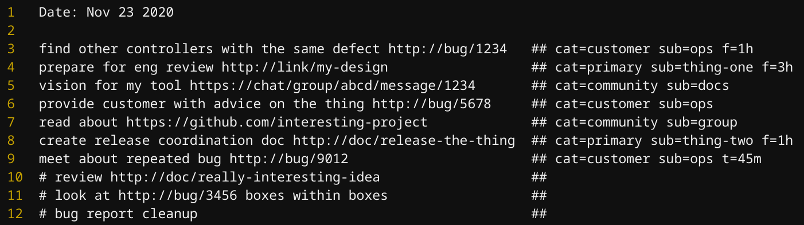
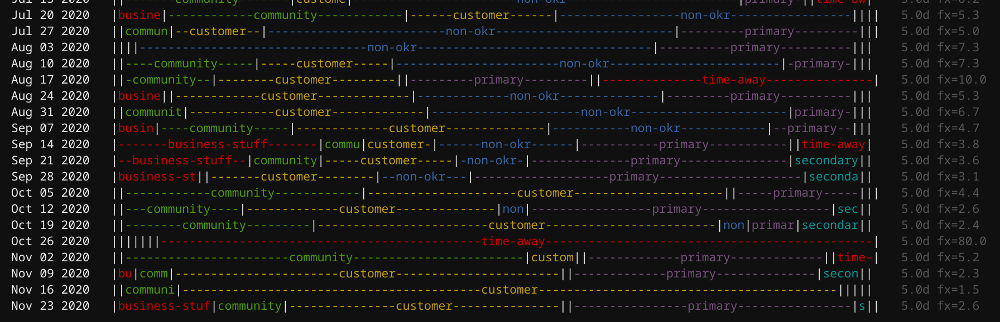

```
Time Flies (tf) is a tool for budgeting focus time.

Usage:
  tf [command]

Available Commands:
  edit        Edit the log file.
  help        Help about any command
  tidy        Reformats log to spark joy.
  todo        List TODO entries.
  tots        Output weekly focus totals.

Flags:
  -c, --config string   Config file. JSON serialization of pkg/cmd/Config.
  -f, --focus string    Focus on a particular label group.
  -g, --group strings   Group entries by labels.
  -h, --help            help for tf
  -l, --log string      Log file.
  -p, --period string   Aggregation period.

Use "tf [command] --help" for more information about a command.
```
# Overview

Time Flies (`tf`) is a text-oriented tool for keeping track of focus time. The center of `tf` is the log, a plaintext file into which daily activities are written, one per line. The log is as a record with metadata (time spent, focus category, etc...) and a TODO list.

## Example Log



Output of `tf tots`:



## Philosophy

Time Flies tracks focus time. All the hours of the workday are accounted for by tracking the ratio of focus on various categories of activity. Some activities involve a period of focus as well as some "fuzzy" time surrounding them. Such activites are recorded as fuzzy time (e.g. `f=1h`) from which categories for all hours of the work week are extrapolated. Activies are weighted by time which is a proxy for focus. But some activites simply require a fixed amount of time in which case they are taken literally (e.g. `t=45m`).

The insights given by `tf` are only as good as the categories chosen and the quality of the log file. The format of the log file is chosen to be as simple and easy to maintain as possible. It's essentially the log I was keeping anyway (a.k.a. snippets) with some tags at the end. However the specific category and sub-category values took some long time and reflection to produce.

### My Categories

# Commands

## tots

## edit

## tidy

## todo

# Customization
